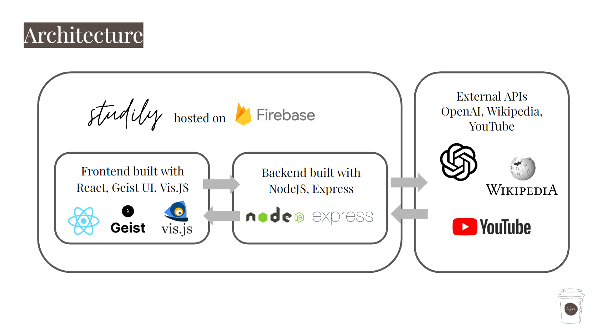
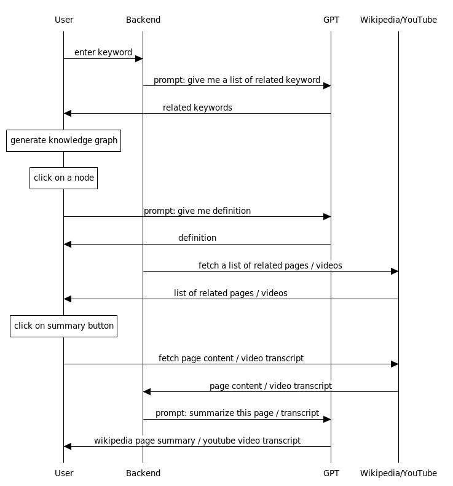

## Studily ☕
    
 
Studily is a study copilot to help you learn faster. 🧐
Given a keyword, it automatically generates a knowledge graph 🕸️ with related terms and definitions. It queries other APIs such as Wikipedia and YouTube to provide more context and resources, with the option to quickly summarize the content inside those links. You're able to expand the knowledge graph with breath-first and depth-first search on any node to further explore and go down the 🐰 hole. 

**[Try it out!](https://studily-ca0ed.web.app/index.html)**  
**[Demo video](https://youtu.be/zs9jxaaXCXU)**

## Contribution
This project was initially made by Samuel Tang (Product Design, Frontend), George Li (Backend/Django) and Sunrui Lu (Full stack) for our *Service Oriented Software Design and Development* class at Tsinghua University. See our original repo [here](https://github.com/codeforcoffee-studio/studily-frontend).   
This expanded version is built by Samuel Tang (Product Design, Full stack) with improved frontend and backend (rewritten in NodeJS/Express).

## Architecture
    
 
Check out the README files in `frontend` & `backend` folder for detailed documentation.   
 
    
 

## Product Design
    
 
breath-first search on a node (toggle off gravity to move nodes around)
    
 
wikipedia summary
    
 
youtube transcript summary
    
 

